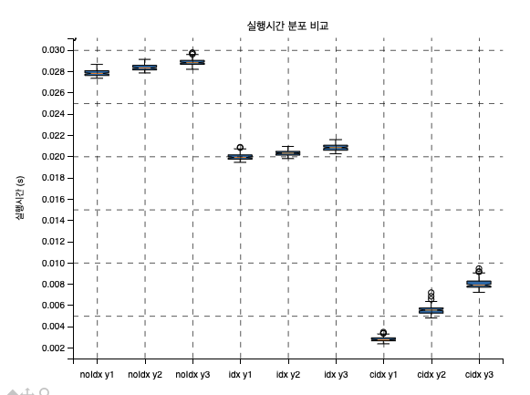
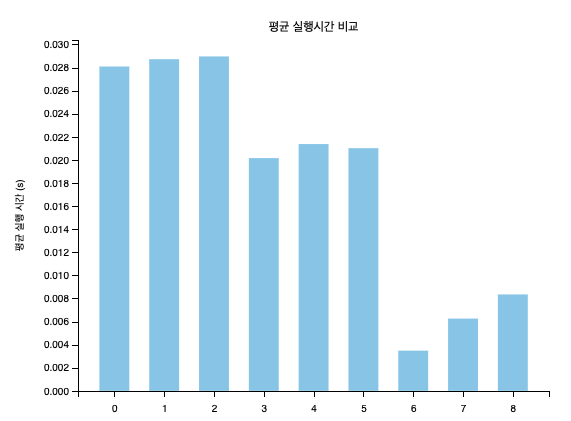

<aside>
✍️ 리포지토리 - https://github.com/ej31/rdb-index-deepdive

</aside>

### **실험 조건**

- 같은 컬럼과 데이터를 가지고 있는 테이블 두 개를 만든다.
- 이 때 인덱스가 없는 테이블(A)에 레인지 조건을 걸고 쿼리를 실행한다.
- 프라이머리 키만 있는 테이블(B)에 레인지 조건을 걸고 쿼리를 실행한다.
- 프라이머리 키 및 복합 인덱스가 있는 테이블(c)에 레인지 조건을 걸고 쿼리를 실행한다.
- 실행 시간을 분석하고 EXPLAIN 쿼리 및 쿼리 프로파일링을 통해 쿼리 수행 내용을 확인한다.

### **실행 시간 결과**

- `Range SELECT` 1년치, 2년치, 3년치까지에 대해서 인덱스가 없을때, 기본키만 있을때, 기본키 및 복합키가 있을때의 케이스로 나눠서 테스트 했으며 한 케이스당 쿼리 수행 횟수는 100회이다.




X축 범례 및 순서는 박스플롯 그래프와 같다.

- 실험을 시작하기 전에 기본키 및 인덱스가 없으면 실행 속도가 풀스캔으로 인해 쿼리 수행 속도가 느릴 것으로 예상했다.
- 실제 결과는 서로 30% 정도의 차이 밖에 나지 않았다. 예상치를 훨씬 상회하는 쿼리 실행 속도였다.
- 왜일까?
    
    > 테이블에 PRIMARY KEY 또는 적합한 UNIQUE 인덱스가 없는 경우 InnoDB는 행 ID 값이 포함된 합성 열에 GEN_CLUST_INDEX라는 숨겨진 클러스터형 인덱스를 생성합니다. 행은 InnoDB가 할당한 행 ID를 기준으로 정렬됩니다.
    >
    > ref> [MySQL 에는 숨겨진 인덱스가 있다](https://dev.mysql.com/doc/refman/8.4/en/innodb-index-types.html)
    > 

### **주의사항**

- Workbench, Datagrip 같은 GUI 툴에서는 기본적으로 쿼리 결과에`limit` 절이 설정 되어 있다.
- 이떄 `limit`절 있는채 쿼리를 실행하면 인덱스가 있는 것과 없는 것의 실행 결과 차이가 같거나 반대로 나오는 경우가 있다.
- 이 옵션을 해제하거나`ALL`옵션으로 바꾸고 진행해야 한다.
    - 옵션 못찾겠으면 다음 페이지로 넘겨보면 성능 차이가 한 눈에 보인다.

## **제반 자료**

테이블 스크립트

```sql
create schema index_test;

use index_test;

-- 인덱스가 없는 employees_nonindexed 테이블 생성
CREATE TABLE employees_nonindexed (
    id INT AUTO_INCREMENT PRIMARY KEY,
    name VARCHAR(50),
    department VARCHAR(50),
    hire_date DATE
);

-- 인덱스가 있는 employees_indexed 테이블 생성
CREATE TABLE employees_indexed (
    id INT AUTO_INCREMENT PRIMARY KEY,
    name VARCHAR(50),
    department VARCHAR(50),
    hire_date DATE,
    INDEX idx_department (department)  -- department 컬럼에 인덱스 생성
);

-- 인덱스가 있는 employees_indexed 테이블 생성
CREATE TABLE employees_indexed_with_composite (
    id INT AUTO_INCREMENT PRIMARY KEY,
    name VARCHAR(50),
    department VARCHAR(50),
    hire_date DATE,
    INDEX idx_department (department)  -- department 컬럼에 인덱스 생성
);

-- 프로시저 생성
-- 프로시저가 이미 존재하는 경우 삭제
DROP PROCEDURE IF EXISTS dummer;

-- 프로시저 생성
DELIMITER $$
CREATE PROCEDURE dummer(IN num_rows INT)
BEGIN
    DECLARE i INT DEFAULT 0;
    DECLARE batch_size INT DEFAULT 1000; -- 한 번에 처리할 행의 수
    DECLARE random_name VARCHAR(50);
    DECLARE random_department VARCHAR(50);
    DECLARE random_date DATE;
    DECLARE values_list TEXT DEFAULT '';
    DECLARE names VARCHAR(255) DEFAULT '강동원,김지수,박예진,최준호,이수민';
    DECLARE departments VARCHAR(255) DEFAULT '인사,마케팅,개발,고객지원,영업';

    -- num_rows 만큼 반복하며 데이터 삽입
    WHILE i < num_rows DO
        -- 랜덤 이름, 부서, 날짜 생성
        SET random_name = SUBSTRING_INDEX(SUBSTRING_INDEX(names, ',', FLOOR(1 + RAND() * 5)), ',', -1);
        SET random_department = SUBSTRING_INDEX(SUBSTRING_INDEX(departments, ',', FLOOR(1 + RAND() * 5)), ',', -1);
        SET random_date = DATE_ADD('2010-01-01', INTERVAL FLOOR(RAND() * 3653) DAY);

        -- 값을 리스트에 추가
        SET values_list = CONCAT(values_list, '(', QUOTE(random_name), ',', QUOTE(random_department), ',', QUOTE(random_date), '),');

        SET i = i + 1;

        -- batch_size에 도달하거나 마지막 행일 때 쿼리 실행
        IF i % batch_size = 0 OR i = num_rows THEN
            -- 마지막 콤마 제거
            SET values_list = TRIM(TRAILING ',' FROM values_list);
            -- 쿼리 실행
            SET @sql = CONCAT('INSERT INTO employees_indexed (name, department, hire_date) VALUES ', values_list);
            PREPARE stmt FROM @sql;
            EXECUTE stmt;

            SET @sql = CONCAT('INSERT INTO employees_nonindexed (name, department, hire_date) VALUES ', values_list);
            PREPARE stmt FROM @sql;
            EXECUTE stmt;
            
            SET @sql = CONCAT('INSERT INTO employees_indexed_with_composite (name, department, hire_date) VALUES ', values_list);
            PREPARE stmt FROM @sql;
            EXECUTE stmt;
            DEALLOCATE PREPARE stmt;
            -- 값 리스트 초기화
            SET values_list = '';
        END IF;
    END WHILE;
END$$
DELIMITER ;

call dummer(1000000);

-- employees_nonindexed 인덱스 삭제
alter table employees_nonindexed drop primary key ;

-- 레인지 검색에 대한 복합  인덱스 설정
 create index employees_indexed_department_hire_date_index
                on employees_indexed (department, hire_date)

```

### 쿼리 실행

```sql
-- 단건 조회
set profiling = 1;
SELECT * FROM employees_nonindexed WHERE department = '개발' and hire_date between  '2014-01-01' and '2014-01-05';
show profiles;
show profile for query 312;

-- 단건 조회
set profiling = 1;
SELECT * FROM employees_indexed WHERE department = '개발' and hire_date between  '2014-01-01' and '2015-01-01';
show profiles;
show profile for query 643;

-- 단건 조회
set profiling = 1;
SELECT * FROM employees_indexed_with_composite WHERE department = '개발' and hire_date between  '2014-01-01' and '2015-01-01';
show profiles;
show profile for query 102;

EXPLAIN SELECT * FROM employees_nonindexed WHERE department = '개발' and hire_date between  '2014-01-01' and '2015-01-01';
EXPLAIN SELECT * FROM employees_indexed WHERE department = '개발' and hire_date between  '2014-01-01' and '2015-01-01';
EXPLAIN SELECT * FROM employees_indexed_with_composite WHERE department = '개발' and hire_date between  '2014-01-01' and '2015-01-01';

```

## EXPLAIN 결과 (Range SELECT 6년)

### **nonindexed explain 결과**

- 수행쿼리
    
    ```sql
    explain select * from employees_nonindexed where  hire_date between '2014-01-01' and '2020-01-02';
    explain analyze select * from employees_nonindexed where  hire_date between '2014-01-01' and '2020-01-02';
    ```
    
- 쿼리 결과
    
    | id | select_type | table | partitions | type | possible_keys | key | key_len | ref | rows | filtered | Extra |
    | --- | --- | --- | --- | --- | --- | --- | --- | --- | --- | --- | --- |
    | 1 | SIMPLE | employees_nonindexed | null | ALL | null | null | null | null | 100035 | 11.11 | Using where |
    
    ```sql
    -> Filter: (employees_nonindexed.hire_date between '2014-01-01' and '2020-01-02')  (cost=10092 rows=11114) (actual time=0.0443..73.9 rows=60067 loops=1)
        -> Table scan on employees_nonindexed  (cost=10092 rows=100035) (actual time=0.0311..42.6 rows=100000 loops=1)
    
    ```
    
- 참조로우: 100,035 (풀스캔)
- 코스트: 10,092

### **indexed explain 결과 (department & hire_date 복합 인덱스 생성 전)**

- 수행쿼리
    
    ```sql
    explain select * from employees_indexed where  hire_date between '2014-01-01' and '2020-01-02';
    explain analyze select * from employees_indexed where  hire_date between '2014-01-01' and '2020-01-02';
    ```
    

- 쿼리 결과   
    
    | id | select_type | table | partitions | type | possible_keys | key | key_len | ref | rows | filtered | Extra |
    | --- | --- | --- | --- | --- | --- | --- | --- | --- | --- | --- | --- |
    | 1 | SIMPLE | employees_indexed | null | ALL | null | null | null | null | 100115 | 11.11 | Using where |
    
    ```sql
    -> Filter: (employees_indexed.hire_date between '2014-01-01' and '2020-01-02')  (cost=10100 rows=11123) (actual time=0.0382..43.9 rows=60067 loops=1)
        -> Table scan on employees_indexed  (cost=10100 rows=100115) (actual time=0.0311..20.1 rows=100000 loops=1)
    ```
    
- 참조로우: 100,115
- 코스트:  10,100

### **composite indexed explain 결과**

- 수행쿼리
    
    ```sql
    create index idx_eiwc
    on employees_indexed (department, hire_date);
    
    explain select * from employees_indexed_with_composite force INDEX (idx_eiwc) where  hire_date between '2014-01-01' and '2020-01-02';
    
    explain analyze select * from employees_indexed_with_composite force INDEX (idx_eiwc) where  hire_date between '2014-01-01' and '2020-01-02';
    ```
    
- 쿼리 결과
 
    | id | select_type | table | partitions | type | possible_keys | key | key_len | ref | rows | filtered | Extra |
    | --- | --- | --- | --- | --- | --- | --- | --- | --- | --- | --- | --- |
    | 1 | SIMPLE | employees_indexed_with_composite | null | range | idx_eiwc | idx_eiwc | 4 | null | 1 | 100 | Using index condition |
    
    ```sql
    -> Index range scan on employees_indexed_with_composite using idx_eiwc over ('2014-01-01' <= hire_date <= '2020-01-02'), with index condition: (employees_indexed_with_composite.hire_date between '2014-01-01' and '2020-01-02')  (cost=0.71 rows=1) (actual time=0.0324..79.4 rows=60067 loops=1)
    ```
    
- 참조된 로우: 1
- 코스트: 0.71

# 참고사항

`SELECT ANALYZE` 를 통해 도출되는 코스트는 디스크 상태 및 CPU 점유율, 컨텍스트 스위치 등에 영향을 받기 때문에 대략적인 추이 참고용으로만 사용하고 가변성 없는 절대적인 수치 값으로 보지 말아야한다.