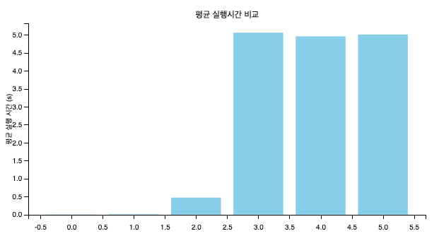
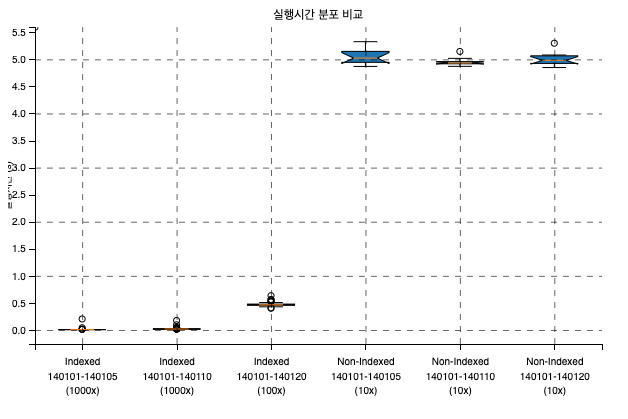
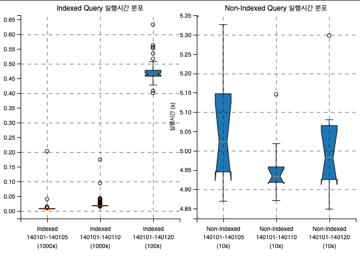

# 인덱스 유무에 따른 실행 시간 비교

## 실행 시간 결과

- 전체 실행시간
  - 

- 실행시간 분포 (케이스 전체)
  - 

- 실행시간 분포 (index, nonindex 나눠서)
  - 

## 주의사항
- Workbench, Datagrip 같은 GUI 툴에서는 기본적으로 쿼리 결과에 `limit` 절이 설정 되어 있다.
- 이떄 `limit` 절 있는채 쿼리를 실행하면 인덱스가 있는 것과 없는 것의 실행 결과 차이가 같거나 반대로 나오는 경우가 있다.
- 이 옵션을 해제하거나 `ALL` 옵션으로 바꾸고 진행해야 한다.
  - 옵션 못찾겠으면 다음 페이지로 넘겨보면 성능 차이가 한 눈에 보인다.

## 제반 자료

테이블 스크립트
```sql
create schema index_test;

use index_test;

-- 인덱스가 없는 employees_nonindexed 테이블 생성
CREATE TABLE employees_nonindexed (
    id INT AUTO_INCREMENT PRIMARY KEY,
    name VARCHAR(50),
    department VARCHAR(50),
    hire_date DATE
);

-- 인덱스가 있는 employees_indexed 테이블 생성
CREATE TABLE employees_indexed (
    id INT AUTO_INCREMENT PRIMARY KEY,
    name VARCHAR(50),
    department VARCHAR(50),
    hire_date DATE,
    INDEX idx_department (department)  -- department 컬럼에 인덱스 생성
);


-- 프로시저가 이미 존재하는 경우 삭제
DROP PROCEDURE IF EXISTS dummer;

-- 프로시저 생성
-- 프로시저가 이미 존재하는 경우 삭제
DROP PROCEDURE IF EXISTS dummer;

-- 프로시저 생성
DELIMITER $$
CREATE PROCEDURE dummer(IN num_rows INT)
BEGIN
    DECLARE i INT DEFAULT 0;
    DECLARE batch_size INT DEFAULT 1000; -- 한 번에 처리할 행의 수
    DECLARE random_name VARCHAR(50);
    DECLARE random_department VARCHAR(50);
    DECLARE random_date DATE;
    DECLARE values_list TEXT DEFAULT '';
    DECLARE names VARCHAR(255) DEFAULT '강동원,김지수,박예진,최준호,이수민';
    DECLARE departments VARCHAR(255) DEFAULT '인사,마케팅,개발,고객지원,영업';

    -- num_rows 만큼 반복하며 데이터 삽입
    WHILE i < num_rows DO
        -- 랜덤 이름, 부서, 날짜 생성
        SET random_name = SUBSTRING_INDEX(SUBSTRING_INDEX(names, ',', FLOOR(1 + RAND() * 5)), ',', -1);
        SET random_department = SUBSTRING_INDEX(SUBSTRING_INDEX(departments, ',', FLOOR(1 + RAND() * 5)), ',', -1);
        SET random_date = DATE_ADD('2010-01-01', INTERVAL FLOOR(RAND() * 3653) DAY);

        -- 값을 리스트에 추가
        SET values_list = CONCAT(values_list, '(', QUOTE(random_name), ',', QUOTE(random_department), ',', QUOTE(random_date), '),');

        SET i = i + 1;

        -- batch_size에 도달하거나 마지막 행일 때 쿼리 실행
        IF i % batch_size = 0 OR i = num_rows THEN
            -- 마지막 콤마 제거
            SET values_list = TRIM(TRAILING ',' FROM values_list);
            -- 쿼리 실행
            SET @sql = CONCAT('INSERT INTO employees_indexed (name, department, hire_date) VALUES ', values_list);
            PREPARE stmt FROM @sql;
            EXECUTE stmt;

            SET @sql = CONCAT('INSERT INTO employees_nonindexed (name, department, hire_date) VALUES ', values_list);
            PREPARE stmt FROM @sql;
            EXECUTE stmt;
            DEALLOCATE PREPARE stmt;
            -- 값 리스트 초기화
            SET values_list = '';
        END IF;
    END WHILE;
END$$
DELIMITER ;

call dummer(10000000);

-- employees_nonindexed 인덱스 삭제
alter table employees_nonindexed drop primary key ;

-- 레인지 검색에 대한 복합  인덱스 설정
 create index employees_indexed_department_hire_date_index
                on employees_indexed (department, hire_date)

```

쿼리 실행
```sql

-- 단건 조회
set profiling = 1;
SELECT * FROM employees_nonindexed WHERE department = '개발' and hire_date between  '2014-01-01' and '2014-01-05';
show profiles;
show profile for query 312;

-- 단건 조회
set profiling = 1;
SELECT * FROM employees_indexed WHERE department = '개발' and hire_date between  '2014-01-01' and '2015-01-01';
show profiles;
show profile for query 643;

EXPLAIN SELECT * FROM employees_nonindexed WHERE department = '개발' and hire_date between  '2014-01-01' and '2015-01-01';
EXPLAIN SELECT * FROM employees_indexed WHERE department = '개발' and hire_date between  '2014-01-01' and '2015-01-01';

```


### nonindexed explain 결과
`EXPLAIN SELECT * FROM employees_nonindexed WHERE department = '개발' and hire_date between  '2014-01-01' and '2015-01-01';`

| id | select\_type | table | partitions | type | possible\_keys | key | key\_len | ref | rows | filtered | Extra |
| :--- | :--- | :--- | :--- | :--- | :--- | :--- | :--- | :--- | :--- | :--- | :--- |
| 1 | SIMPLE | employees\_nonindexed | null | ALL | null | null | null | null | 13743887 | 1.11 | Using where |

- 참조하는 로우의 수가 "13,743,887" 건 
- 평균 실행 시간

### indexed explain 결과 (department & hire_date 복합 인덱스 생성 전)
`EXPLAIN SELECT * FROM employees_indexed WHERE department = '개발' and hire_date between  '2014-01-01' and '2015-01-01';`

| id | select\_type | table | partitions | type | possible\_keys | key | key\_len | ref | rows | filtered | Extra |
| :--- | :--- | :--- | :--- | :--- | :--- | :--- | :--- | :--- | :--- | :--- | :--- |
| 1 | SIMPLE | employees\_indexed | null | ref | idx\_department | idx\_department | 203 | const | 5803444 | 11.11 | Using where |

- 참조하는 로우의 수가 "5,803,444" 건 

### indexed explain 결과 (department & hire_date 복합 인덱스 생성 후)

| id | select\_type | table | partitions | type | possible\_keys | key | key\_len | ref | rows | filtered | Extra |
| :--- | :--- | :--- | :--- | :--- | :--- | :--- | :--- | :--- | :--- | :--- | :--- |
| 1 | SIMPLE | employees\_indexed | null | range | idx\_department,employees\_indexed\_department\_hire\_date\_index | employees\_indexed\_department\_hire\_date\_index | 207 | null | 549884 | 100 | Using index condition; Using MRR |

- 참조하는 로우의 수가 "549,884" 건

